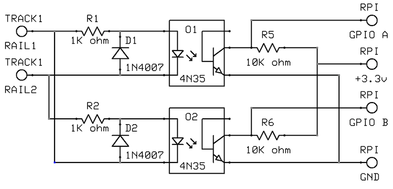

# Schematic

## Description

Power from the rails is fed into a pair of 4N35 opto-isolators to keep the 
Raspberry Pi isolated from the track power.  Two isolators are used wired
in an inverted arrangement.  Only one is necessary for a basic decoder, this
arrangement allows decoding of both the positve and inverted signal.  It is
also necessary to properly detect AC or DC on the rails, if that is desired.

Each input uses a 1K ohm resistor to drop the voltage for the diode in the 
opto-isolator.  A 1N4007 dioed is also wired in the reverse orientation from
the opto-isolator to sink any reverse current, preventing an over-voltage
situation in the reverse direction on the opto-isolator.

On the Raspberry Pi side, a 10K ohm resistor is used as a positive pull up
on the collector, and is wired to the 3.3v supply of the Raspberry Pi.  The
emitter is wired to the ground on the Raspberry Pi.  The base of the 
opto-isolator is not connected in this circuit.  Each collector is then wired
to a GPIO pin on the Raspberry Pi as the signal input.

## New to hardware hacking?

Some recommendations for starting out:

* [Raspberry Pi Breadboard Adapter](https://www.amazon.com/gp/product/B07DK8DVBV)
* [Electronics Component Kit](https://www.amazon.com/gp/product/B073ZC68QG)
* [Additional Opto-Isolators](https://www.amazon.com/gp/product/B00B88AOS6)
