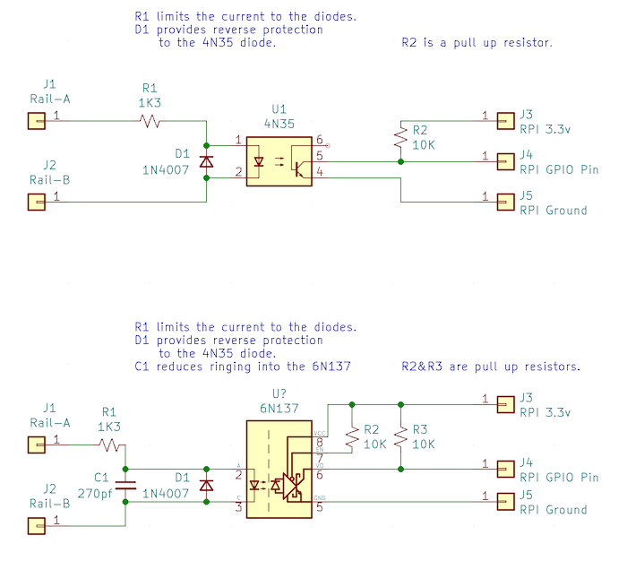

# Schematic

Full source to the schematic is also in the KiCad directory.

## Description

The schematic shows interfacing with the RPI two different ways using
commonly available opto-isolators.  The first example uses a 4N35, often
included in various electronics tinkering kits.  The second example uses
a slightly newer and better 6N137 device.  Both work nearly the same.

Power from the rails is fed into the front end of the opto-isolator.  A
resistor (R1) is used to limit current, a diode (D1) is used to provide
reverse polarity protection, and optionally a capacitor (C1) can reduce
ringing on the input from noisy DCC supplies.

The output of the opto-isolator is wired to a GPIO pin on the Raspberry Pi.
This requires connections to ground, the GPIO pin, and power.  For the 4N35
part a single pull up resistor is all that is required.  For the 6N137 in
addition to a pull up for the signal pin one is required on the ENable pin,
and the device also needs the 3.3v power input.

The only particular critical value is R1, the current limiting resistor.
The opto-isolators recommand 5ma to 20ma current, and the ideal situation
is to support DCC voltages from around 8v (2v below Z scale) to 26 volts
(2v above garden scale).

Ohms law tells us Current (I) = Voltage (V) / Resistance (R):

- 26v / 1.3K = 20ma
- 8v / 1.3K = 6.15ma

A 1.3K resistor is not a typical value in most kits.  If using Z/N/HO voltages
a 1K resistor provides a good range, and if doing O/G/Garden a 2K resistor
provides a good range.

## New to hardware hacking?

Some recommendations for starting out:

* [Raspberry Pi Breadboard Adapter](https://www.amazon.com/gp/product/B07DK8DVBV)
* [Electronics Component Kit](https://www.amazon.com/gp/product/B073ZC68QG)
* [4N35](https://www.amazon.com/gp/product/B00B88AOS6)
* [6N137](https://www.amazon.com/gp/product/B00B88AQO8)
